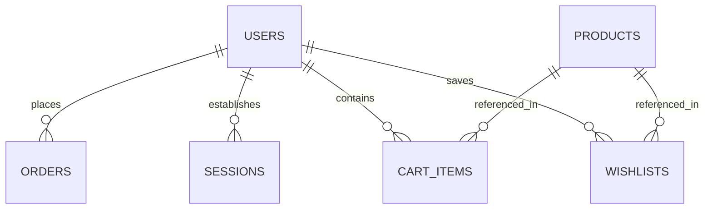

# Zanny Collection Database Schema & Data Collection Guide

This guide details the structure and data definitions of the unified Cloudflare D1 database (`zanny-db`). Both the Flutter mobile application and the Cloudflare Pages website read and write to this shared database to enable seamless, real-time data synchronization.

---

## 🏗️ Schema Overview & Relationships

Below is the entity-relationship layout of the database. The core tables center around user profiles, inventory management, user interactions (wishlist, cart), and transactions (orders).



---

## 🗄️ Detailed Table Schemas

### 1. `users`
Stores customer, guest, and admin profiles, login history, and security/payment restriction metadata.

| Column | Type | Default | Description |
| :--- | :--- | :--- | :--- |
| `id` | `TEXT` | *None* | Primary Key (typically a UUID). |
| `email` | `TEXT` | *None* | Unique email address (normalized to lowercase). |
| `password_hash` | `TEXT` | `NULL` | PBKDF2 hash of the password (for email/password logins). |
| `salt` | `TEXT` | `NULL` | Hex salt used during PBKDF2 hashing. |
| `first_name` | `TEXT` | `''` | User's first name. |
| `last_name` | `TEXT` | `''` | User's last name. |
| `full_name` | `TEXT` | `''` | Combined full name. |
| `phone` | `TEXT` | `''` | User phone number. |
| `phone_number` | `TEXT` | `''` | Alternative phone number. |
| `avatar_url` | `TEXT` | `''` | Profile picture hosting link (R2 or external provider). |
| `role` | `TEXT` | `'customer'` | Authorization role (`'customer'`, `'admin'`). |
| `is_admin` | `INTEGER` | `0` | Flag (1 for admin, 0 for customer). |
| `is_verified` | `INTEGER` | `0` | Flag (1 if email confirmed via verification code). |
| `auth_provider` | `TEXT` | `'local'` | Authentication type (`'local'` or `'google'`). |
| `login_count` | `INTEGER` | `0` | Number of successful login sessions. |
| `last_login` | `TEXT` | `NULL` | ISO 8601 timestamp of last login. |
| `fcm_token` | `TEXT` | `''` | Firebase Cloud Messaging device token (for push updates). |
| `consecutive_cancellations` | `INTEGER` | `0` | Counter tracking consecutive canceled Cash-on-Delivery (COD) orders. |
| `restricted_from_cod` | `INTEGER` | `0` | Flag (1 if user is banned from COD options). |
| `consecutive_successful_orders` | `INTEGER` | `0` | Tracks reliable customers for promotions/unlocking privileges. |
| `default_delivery_zone` | `TEXT` | `''` | Location zone for shipping calculator. |
| `default_address` | `TEXT` | `''` | Default shipping address string. |
| `created_at` | `TEXT` | `(datetime('now'))` | Timestamp when user record was created. |

---

### 2. `products`
Defines the fashion inventory, media galleries, pricing, and stock metrics.

| Column | Type | Default | Description |
| :--- | :--- | :--- | :--- |
| `id` | `TEXT` | *None* | Unique Product ID (slug or UUID). |
| `name` | `TEXT` | *None* | Product name (e.g. "Oversized ZC Heavyweight Hoodie"). |
| `subtitle` | `TEXT` | `''` | Secondary label (e.g. "New Season"). |
| `discount_label` | `TEXT` | `''` | Banner label for promotional visibility. |
| `description` | `TEXT` | `''` | Full text formatting product details. |
| `price` | `REAL` | *None* | Active price in local currency. |
| `original_price` | `REAL` | `NULL` | Pre-discount price (used for computing sale discounts). |
| `category` | `TEXT` | `''` | Category classification. |
| `category_slug` | `TEXT` | `''` | Url-safe category index slug. |
| `image_url` | `TEXT` | `''` | Primary thumbnail image key/link. |
| `gallery_urls` | `TEXT` | `'[]'` | JSON Array of secondary image URLs. |
| `images` | `TEXT` | `'[]'` | Fallback JSON Array of product images. |
| `colors` | `TEXT` | `'[]'` | JSON Array of available color naming configurations. |
| `sizes` | `TEXT` | `'[]'` | JSON Array of sizes (e.g., `["S", "M", "L"]`). |
| `variations` | `TEXT` | `'[]'` | JSON Array of specific color/size variations object metadata. |
| `stock` | `INTEGER` | `10` | Units available in active warehouse storage. |
| `sold` | `INTEGER` | `0` | Lifetime quantity sold (used for sorting popularity). |
| `badge` | `TEXT` | `''` | Product catalog highlight badge (`'NEW'`, `'SALE'`). |
| `is_new` | `INTEGER` | `0` | Boolean flag. |
| `is_sale` | `INTEGER` | `0` | Boolean flag. |
| `is_active` | `INTEGER` | `1` | Flag to hide/show products in listings. |
| `is_deleted` | `INTEGER` | `0` | Flag for soft deleting products. |
| `created_at` | `TEXT` | `(datetime('now'))` | Product creation timestamp. |

---

### 3. `cart_items`
Tracks live cart states across client devices. Automatically synchronized when logged in.

| Column | Type | Default | Description |
| :--- | :--- | :--- | :--- |
| `id` | `TEXT` | *None* | Primary Key (Composite string: `{user_id}-{product_id}-{color}-{size}`). |
| `user_id` | `TEXT` | *None* | Owner's User ID. |
| `product_id` | `TEXT` | *None* | Product reference ID. |
| `quantity` | `INTEGER` | `1` | Quantity added. |
| `size` | `TEXT` | `''` | Selected size specification. |
| `color` | `TEXT` | `''` | Selected color specification. |
| `created_at` | `TEXT` | `(datetime('now'))` | Creation timestamp. |

---

### 4. `wishlists`
Stores favorited items for custom user collections.

| Column | Type | Default | Description |
| :--- | :--- | :--- | :--- |
| `user_id` | `TEXT` | *None* | Composite Primary Key referencing `users(id)`. |
| `product_id` | `TEXT` | *None* | Composite Primary Key referencing `products(id)`. |
| `created_at` | `TEXT` | `(datetime('now'))` | Timestamp. |

---

### 5. `orders`
Logs final purchase operations, tracking state, and payment references (e.g., M-Pesa).

| Column | Type | Default | Description |
| :--- | :--- | :--- | :--- |
| `id` | `TEXT` | *None* | Order confirmation ID (e.g., `ZC_ORD_17812984`). |
| `user_id` | `TEXT` | *None* | Customer ID. |
| `items` | `TEXT` | `'[]'` | JSON serialized list of products, sizes, quantities, and prices. |
| `total_amount` | `REAL` | `0` | Total checkout value. |
| `status` | `TEXT` | `'pending'` | Order state (`'pending'`, `'confirmed'`, `'shipped'`, `'delivered'`). |
| `delivery_address` | `TEXT` | `''` | Detailed street address. |
| `shipping_address` | `TEXT` | `''` | Alternative shipping destination details. |
| `recipient_name` | `TEXT` | `''` | Package recipient name. |
| `recipient_phone` | `TEXT` | `''` | Core contact number for delivery rider. |
| `phone_number` | `TEXT` | `''` | Backup phone number. |
| `mpesa_checkout_id` | `TEXT` | `''` | M-Pesa STK push CheckoutRequestID. |
| `mpesa_receipt` | `TEXT` | `''` | M-Pesa transaction receipt code (e.g. `RLN8104HS`). |
| `mpesa_phone` | `TEXT` | `''` | Payment reference phone number. |
| `review_prompt_dismissed` | `INTEGER` | `0` | Flag (1 to hide rating prompts in-app). |
| `tracking_number` | `TEXT` | `''` | Shipping carrier tracking code. |
| `confirmed_at` | `TEXT` | `NULL` | Timestamp order changed to confirmed. |
| `shipped_at` | `TEXT` | `NULL` | Timestamp package left dispatch. |
| `delivered_at` | `TEXT` | `NULL` | Timestamp customer marked order as received. |
| `created_at` | `TEXT` | `(datetime('now'))` | Record creation. |

---

### 6. `sessions`
Logs user sessions on the website.

| Column | Type | Default | Description |
| :--- | :--- | :--- | :--- |
| `id` | `TEXT` | *None* | Session token ID. |
| `user_id` | `TEXT` | *None* | Reference to `users(id)`. |
| `ip_address` | `TEXT` | `NULL` | Device IP address (used for abuse tracking). |
| `user_agent` | `TEXT` | `NULL` | Browser User-Agent header metadata. |
| `device_name` | `TEXT` | `NULL` | Normalized hardware descriptor. |
| `expires_at` | `TEXT` | *None* | Expiration timestamp. |
| `created_at` | `TEXT` | `(datetime('now'))` | Created timestamp. |

---

### 7. `verification_codes`
Tracks 6-digit confirmation codes sent via email.

| Column | Type | Default | Description |
| :--- | :--- | :--- | :--- |
| `id` | `TEXT` | *None* | Code tracking ID. |
| `email` | `TEXT` | *None* | Destination email. |
| `code` | `TEXT` | *None* | 6-digit verification code string. |
| `expires_at` | `TEXT` | *None* | Expiration timestamp. |
| `created_at` | `TEXT` | `(datetime('now'))` | Generated timestamp. |

---

## 🔄 Live Sync Conventions & JSON Storage

When writing updates to the database from the website code:
1. **JSON Fields**: Ensure arrays such as `images`, `colors`, `sizes`, and `gallery_urls` are serialized to string formatting (`JSON.stringify()`) before inserting/updating.
2. **Boolean Mapping**: SQLite does not support native boolean types. Use `1` (true) and `0` (false) for integers.
3. **Cart Identifiers**: The `cart_items` primary key must follow the naming pattern:
   ```javascript
   const key = `${user_id}-${product_id}-${color}-${size}`;
   ```
   This ensures cart updates are upsert-safe and prevent duplicate line items.
