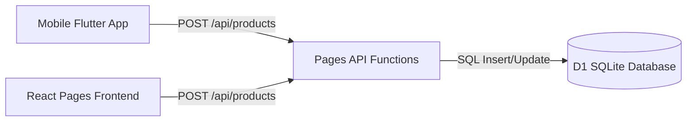

# Zanny Collection - Product Synchronization & Data Integration Guide

This guide explains the data format and synchronization specifications between the Flutter mobile application, the Cloudflare D1 SQLite database, and the Cloudflare Pages backend. It serves as a reference for the web developer to align the frontend web app's database queries, variation builders, and stock validation calls with the mobile application's schema standard.

---

## 🏗️ Synchronization Architecture

Both clients share the same SQLite database (`zanny-db` on D1) and object store (`zanny-images` on R2). They communicate securely via Pages Functions endpoints.



---

## 📦 Mobile App Product Data Structure

The mobile application sends a flat product dataset because it handles sizes, colors, and stock individually at the product level rather than relying on a custom, nested variations layout. 

When the mobile app performs a **POST** (`/api/products`) or **PUT** (`/api/products/:id`), it transmits the following JSON payload:

```json
{
  "id": "1781519495606",
  "name": "Everyday Essentials Premium Fleece Shorts",
  "subtitle": "Casual Lounge",
  "description": "Heavy organic cotton shorts with tactical side pockets.",
  "price": 2700.0,
  "original_price": 3200.0,
  "images": [
    "https://pub-0a4117480fe8436ca1a1255ce208d231.r2.dev/products/image1.jpg",
    "https://pub-0a4117480fe8436ca1a1255ce208d231.r2.dev/products/image2.jpg"
  ],
  "colors": ["Black", "Heather Grey", "Off-White"],
  "sizes": ["S", "M", "L"],
  "category": "shorts-sweatpants",
  "is_new": true,
  "is_sale": true,
  "stock": 18
}
```

### Key Differences from Web Frontend:
1. **`images` (Array)**: Mobile sends a flat string array of resolved R2 image URLs, whereas the web app sends a separate `image` string (thumbnail) and `gallery_urls` string array.
2. **`colors` & `sizes` (Arrays)**: Mobile sends these as flat lists of strings.
3. **`stock` (Integer)**: Mobile records a single global stock level (`18`) for the product.
4. **`variations` (Absent)**: Mobile does not generate nested size-color variation maps client-side.

---

## ⚙️ Backend API Processing (Auto-Healing)

To guarantee that products created on the mobile app do not crash the website or render as "Out of Stock" (due to missing variations), the server-side Page API handlers (`/api/products` and `/api/products/[id].js`) perform the following data normalization step:

### 1. Image Separation
If `image` and `gallery_urls` are missing but a flat `images` array is provided:
- `image_url` is assigned to `images[0]`.
- `gallery_urls` is assigned to `images.slice(1)`.

### 2. Auto-Generating Variations & Stock Distribution
If the `variations` field is missing or empty, the server automatically builds the combinations array based on the `colors`, `sizes`, and `stock` fields:
- It creates combinations for every color-size pair.
- The global `stock` count is divided evenly across all combinations (with the remainder added to the final variation) so that `SUM(variations.quantity) == stock`.

For example, if `stock: 18`, `colors: ["Black", "White"]`, and `sizes: ["S", "M"]` (4 variations total):
- `Black - S`: quantity 4
- `Black - M`: quantity 4
- `White - S`: quantity 4
- `White - M`: quantity 6 (includes remainder)

The resulting variations JSON is serialized to `variations` column in D1:
```json
[
  {"color": "Black", "size": "S", "quantity": 4},
  {"color": "Black", "size": "M", "quantity": 4},
  {"color": "White", "size": "S", "quantity": 4},
  {"color": "White", "size": "M", "quantity": 6}
]
```

---

## 💡 Recommendations for the Web Developer

To keep both clients working perfectly in sync:

1. **Variations Parsing**: Continue to parse the `variations` JSON column on load:
   ```javascript
   let parsedVariations = [];
   try {
     if (product.variations) parsedVariations = JSON.parse(product.variations);
   } catch(e) {}
   ```
2. **Quantity Display & Capping**: Always validate selected quantity in the cart against both `variations.quantity` and the global `products.stock` limit. 
3. **Healing Nulls**: If the D1 database contains legacy records with `variations = NULL` or `stock = 0`, they should be migrated or healed to ensure they render active size/color options on the website frontend.
