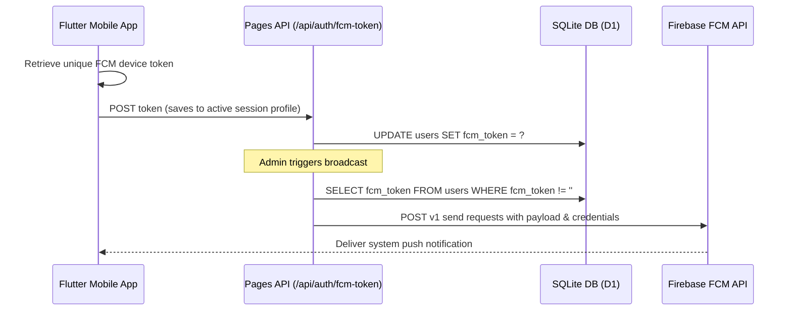

# Zanny Collection - Push Notifications & Marketing Broadcast Guide

This document outlines how the **Push Notification System** functions in the Zanny Collection platform. It details how device registration tokens are saved, how to authenticate with Firebase Cloud Messaging (FCM) on the server side, and how the website creator can write broadcast functions to send system alerts (e.g., updates or advertising adverts) directly to users' phones with the custom logo.

---

## 🏗️ Notification System Overview

FCM (Firebase Cloud Messaging) handles delivering messages to Android/iOS devices even when the app is closed.



---

## 📱 1. Device Token Registration (Mobile Side)

When a user logs in or launches the mobile app, the application requests notification permissions and saves the FCM registration token to the backend:

- **Mobile Client Action**: Sends a `POST` request to `/api/auth/fcm-token`.
- **Payload**:
  ```json
  { "token": "fcm-registration-token-string" }
  ```
- **Backend Function**: Stored under `/functions/api/auth/fcm-token.js`, this updates the `fcm_token` column in the D1 `users` table for the authenticated user ID.

---

## 🖥️ 2. Server-Side Broadcast Integration (Web Creator Actions)

To send notifications from Cloudflare Pages API functions, the website developer must connect to the **Firebase Cloud Messaging HTTP v1 API**.

### Step A: Download Firebase Service Account JSON
1. Open the **Firebase Console**.
2. Go to **Project Settings** -> **Service Accounts**.
3. Click **Generate New Private Key** and download the `.json` file.
4. Add the service account private key parameters to the Cloudflare environment secrets (e.g., in Pages Settings -> Environment Variables):
   - `FIREBASE_PROJECT_ID`
   - `FIREBASE_CLIENT_EMAIL`
   - `FIREBASE_PRIVATE_KEY` (ensure newlines are preserved)

### Step B: Implement OAuth2 Token Generation
Cloudflare Workers run in a serverless V8 isolate environment, meaning standard Node.js libraries (`firebase-admin`) are not supported directly. The developer must use pure JavaScript/web-crypto to sign a JWT assertion and fetch an access token:

```javascript
// Example helper to get Google OAuth token inside Cloudflare Workers
async function getAccessToken(env) {
  const header = { alg: "RS256", typ: "JWT" };
  const now = Math.floor(Date.now() / 1000);
  const payload = {
    iss: env.FIREBASE_CLIENT_EMAIL,
    scope: "https://www.googleapis.com/auth/firebase.messaging",
    aud: "https://oauth2.googleapis.com/token",
    exp: now + 3600,
    iat: now
  };

  // Sign using Web Crypto API and env.FIREBASE_PRIVATE_KEY
  // (Standard RS256 signing utility)
  const token = await signJwt(header, payload, env.FIREBASE_PRIVATE_KEY);
  
  const res = await fetch("https://oauth2.googleapis.com/token", {
    method: "POST",
    headers: { "Content-Type": "application/x-www-form-urlencoded" },
    body: `grant_type=urn:ietf:params:oauth:grant-type:jwt-bearer&assertion=${token}`
  });
  const data = await res.json();
  return data.access_token;
}
```

### Step C: Create the Broadcast Endpoint
Create an admin-only endpoint `/api/admin/broadcast-notification` that fetches tokens from the database and sends payloads to FCM:

```javascript
// POST /api/admin/broadcast-notification
export async function onRequestPost(context) {
  try {
    const auth = await requireAdmin(context);
    if (auth instanceof Response) return auth;

    const { title, body, route } = await context.request.json();
    const token = await getAccessToken(context.env);

    // Get all registered FCM tokens
    const { results } = await context.env.DB.prepare(
      "SELECT fcm_token FROM users WHERE fcm_token IS NOT NULL AND fcm_token != ''"
    ).all();

    const errors = [];
    for (const row of results) {
      try {
        await fetch(`https://fcm.googleapis.com/v1/projects/${context.env.FIREBASE_PROJECT_ID}/messages:send`, {
          method: "POST",
          headers: {
            "Authorization": `Bearer ${token}`,
            "Content-Type": "application/json"
          },
          body: JSON.stringify({
            message: {
              token: row.fcm_token,
              notification: { title, body },
              data: {
                route: route || "/orders", // Route to open in mobile app on tap
              }
            }
          })
        });
      } catch (err) {
        errors.push(err.message);
      }
    }

    return Response.json({ success: true, count: results.length, errors });
  } catch (err) {
    return Response.json({ error: err.message }, { status: 500 });
  }
}
```

---

## 📢 3. Triggering Notifications for Adverts & Updates

### Option 1: Trigger on Product Add (Web Admin Dashboard)
Add a checkbox `Send Push Notification Alert` in the Admin Product Creation form. When checked, the frontend POST payload includes `send_push: true`:
- The server checks this flag inside `onRequestPost` (in `products.js`).
- If true, after inserting the product, the server calls the FCM send utility to notify users:
  ```json
  {
    "title": "New Drop Alert! 🛒",
    "body": "Check out the brand new Zenith Oversized Tee in stock now!",
    "route": "/product/<id>"
  }
  ```

### Option 2: Trigger on App Version Update
When you publish a new update metadata file (`version.json`) via `PUT /api/version`:
- Inside the version update handler, trigger a push notification to all devices:
  ```json
  {
    "title": "New Update Available! 🚀",
    "body": "Version 1.1.0 is live with new payment options. Update now!",
    "route": "/update"
  }
  ```
- Tapping this notification can route directly to the update screen or version checker inside the application.
